# Git-Summary

# 命令总结

[命令总结](https://juejin.cn/post/6844903598522908686#heading-2)

# 本地仓库

## 10.2 环境配置

当安装 Git 后首先要做的事情是设置用户名称和 email 地址。这是非常重要的，因为每次 Git 提交都会使用该用户信息

```shell
#设置用户信息
   git config --global user.name “itcast”
   git config --global user.email “itcast@itcast.cn”
#查看配置信息
   git config --list
   git config user.name
#通过上面的命令设置的信息会保存在~/.gitconfig文件中

```

## 10.3 初始化本地仓库 init

```shell
# 初始化仓库带工作区
git init
# 初始化仓库不带工作区
git init --bare
```

## 10.4 克隆 clone

```shell
# 从远程仓库克隆
git clone 远程Git仓库地址
例如: git clone https://gitee.com/itcast/gittest.git
```

## 10.5 查看状态 status diff

```shell
# 查看状态
git status
#查看状态 使输出信息更加简洁
git status –s
```

```shell
# 比较的是 Git 存储库中的内容
git diff
```

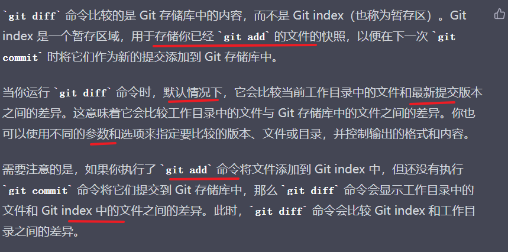

-   没有 add ，比较的是 disk 和 repo 的区别
-   add 后，比较的是 disk 和 index
    -   可以用 reop index disk 三种存储不同数据的例子来验证

## 10.6 add / commit

```shell
# 将未跟踪的文件加入暂存区
git add  <文件名>
# 将暂存区的文件取消暂存 (取消 add )
git reset  <文件名>

```

```shell
# git commit 将暂存区的文件修改提交到本地仓库
git commit -m "日志信息"  <文件名>

```

## 10.8 删除 rm

```shell
# 从本地工作区 删除文件并将其添加到暂存区。
git rm <文件名>

# 从暂存区中删除文件，但是工作区依然还有该文件:
git rm --cached <file>;

# 如果本工作区库误删, 想要回退
git checkout head <文件名>
```

### 删除 Git 的本地仓库和远程仓库

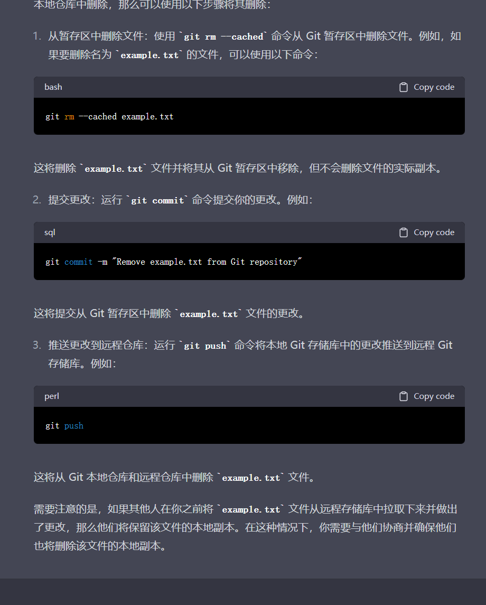

## 其它

这个命令只会更改本地仓库中远程仓库的名称，而不会影响到远程仓库本身。

```shell
# 更改本地仓库中远程仓库的名称
git remote rename oldname newname

```

## git rebase 和 git commit --amend

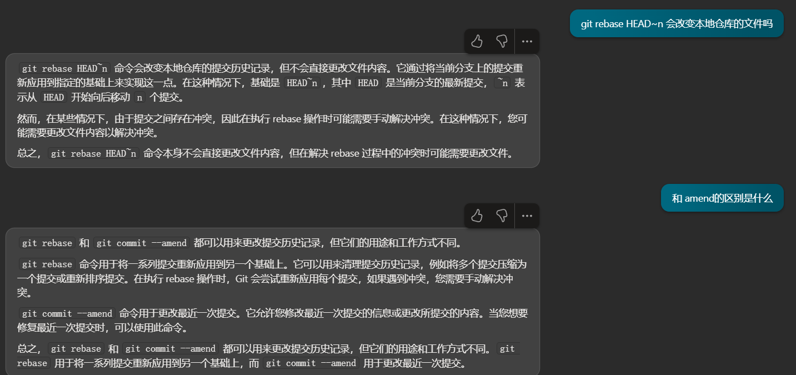

# 11. git 远程仓库操作

## 11.1 查看远程

```shell
# 查看远程  列出指定的每一个远程服务器的简写
git remote
# 查看远程 , 列出 简称和地址
git remote  -v
# 查看远程仓库详细地址
git remote show  <仓库简称>

```

## 11.2 添加/移除远测仓库

```shell
# 添加远程仓库
git remote add <shortname> <url>
# 移除远程仓库和本地仓库的关系(只是从本地移除远程仓库的关联关系，并不会真正影响到远程仓库)
git remote rm <shortname>
```

## 11.3 从远程仓库获取代码

```shell
# 从远程仓库克隆
git clone <url>
# 从远程仓库拉取 (拉取到.git 目录,不会合并到工作区,工作区发生变化)
git fetch  <shortname>  <分支名称>
# 手动合并  把某个版本的某个分支合并到当前工作区
git merge <shortname>/<分支名称>
# 从远程仓库拉取 (拉取到.git 目录,合并到工作区,工作区不发生变化) = fetch+merge
git pull  <shortname>  <分支名称>
```

注意：如果当前本地仓库不是从远程仓库克隆，而是本地创建的仓库，并且仓库中存在文件，此时再从远程仓库拉取文件的时候会报错（fatal: refusing to merge unrelated histories ），解决此问题可以在 git pull 命令后加入参数--allow-unrelated-histories (如上 命令)

### git pull 的冲突

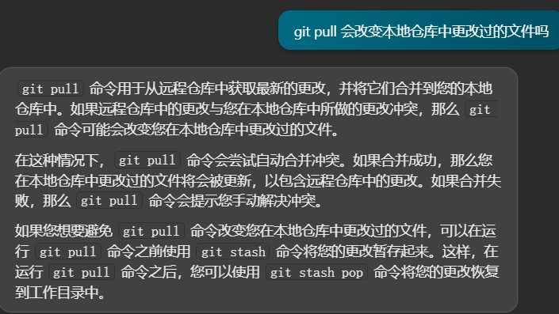

### git merge 和 git pull 的区别

-   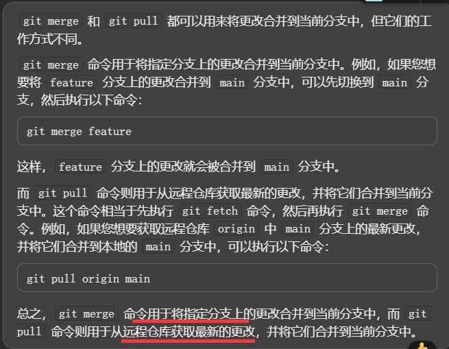

### git merge 和 git rebase 有什么区别？

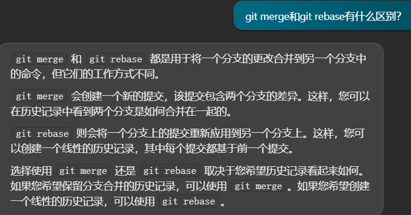

而且 rebase 的好处是相当于在 main 分支上把 my_feature 合并进来了，不影响主分支的干净性。

还在 rebase 的时候解决冲突，不会在 merge 里解决冲突

## push

```shell
# 将本地仓库推送至远程仓库的某个分支
git push [remote-name] [branch-name]

git push -u
```

git push -u origin main 的 -u 是什么

-   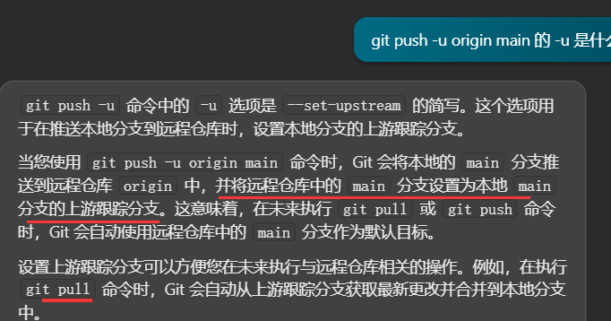

### push 和 clone 太慢

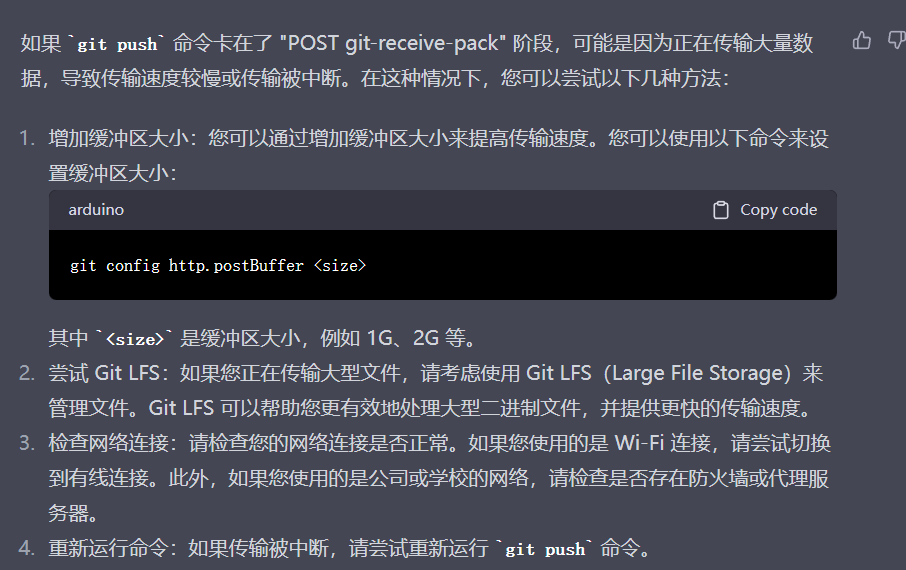

[cite](https://segmentfault.com/a/1190000038971315)

-   增加缓存区大小
    git config --global http.postBuffer 524288000
    ps：push 时遇到报错，也可以用这种方法。这个数值大约是 500M（具体怎么计算的找了好久没有相关信息，希望有知道的大佬告知下，万分感谢）。
-   减小要 clone 的项目大小
    git clone https://github.com/youzan/van... --depth 1
    ps: 这里解释一下，--depth 1，的意思是只 clone 默认分支的最新一次提交。有童鞋要是想 clone 所有的分支，网上也有解决办法，可自行搜索。这个不在本次要说的范围内。
-   换协议
    例如：将 git clone https://github.com/youzan/van...，
    改为 git clone git://github.com/youzan/vant.git

### 修改已经 push 的 commit 的评论

# 12. 分支

```shell
# 默认 分支名称为 master
# 列出所有本地分支
git branch
# 列出所有远程分支
git branch -r
# 列出所有本地分支和远程分支
git branch -a
# 创建分支
git branch <分支名>
# 切换分支
git checkout <分支名>
# 删除分支(如果分支已经修改过,则不允许删除)
git branch -d  <分支名>
# 强制删除分支
git branch -D  <分支名>
```

```shell
# 提交分支至远程仓库
git push <仓库简称> <分支名称>
# 合并分支 将其他分支合并至当前工作区
git merge <分支名称>
# 删除远程仓库分支
git push origin –d branchName
```

如何改远程和本地仓库的分支名

-   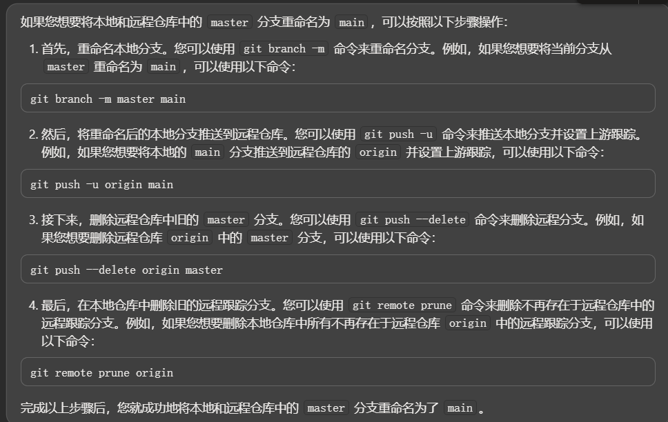

# 13 . 命令行 --tag

```shell
# 列出所有tag
git tag
# 查看tag详细信息
git show [tagName]
# 新建一个tag
git tag [tagName]
# 提交指定tag
$ git push [仓库简称] [tagName]
# 新建一个分支，指向某个tag
$ git checkout -b [branch] [tag]
# 删除本地tag
$ git tag -d [tag]
# 删除远程tag (注意 空格)
$ git push origin :refs/tags/[tag]
```

# git 撤销操作

[cite](https://www.bilibili.com/video/BV1ne4y1S7S9?share_source=copy_web)

这里的 init 类比我空白的 1.txt，而不是 git init，因为 .git 空的时候 commit 不了

## Disk

git checkout <changed_file>

(git restore <changed_file>)

## Stage

git reset <changed_file>
(git restore --staged <changed_file> )

-   不会对 Disk 文件修改，只撤回 stage
-   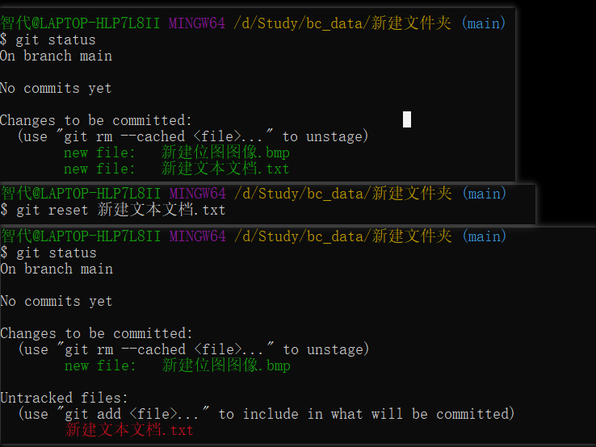

git checkout HEAD -- <chaned_file>

-   撤回 Disk 和 stage
-   git checkout HEAD -- 1.txt 有什么用
    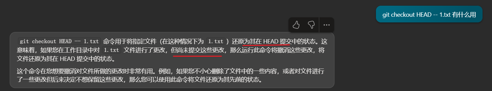
-   HEAD 提交中的状态是什么
    

-   bug 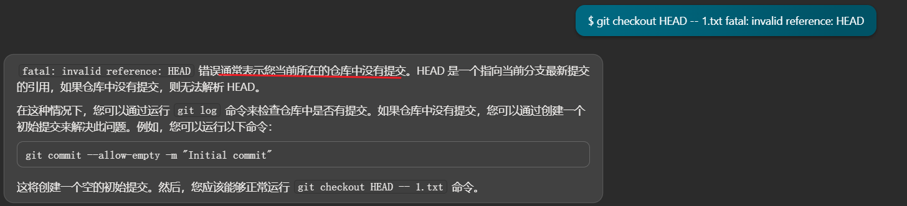
    -   应该是因为我 local git 是空的，练 .git 都没有（init）
    -   我 commit 了 1.txt 的修改后，才撤回成功
    -   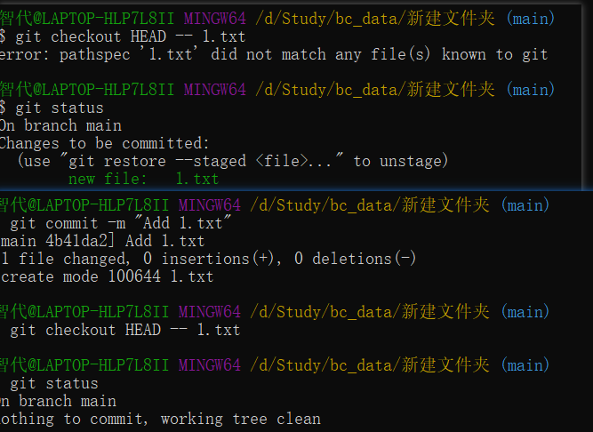

## Local repo

### reset

只针对 git log 的 commit，不针对某个文件

git reset --soft HEAD~1

-   只撤销 commit 的一个记录，重置 HEAD 到前一个 commit

git reset HEAD~1

-   撤销 commit 版本同时清除 add 添加的缓存，只保留 Disk 的修改
-   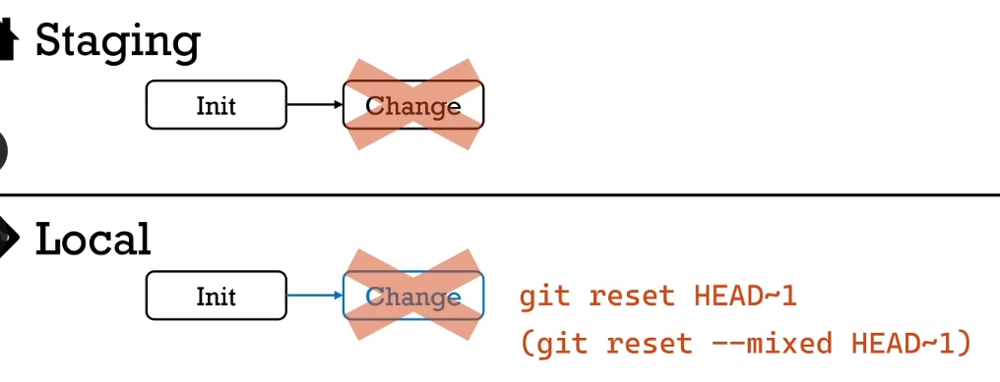

git reset --hard HEAD~1

-   完全回滚(撤销已经提交的版本、放弃已经添加的缓存、甚至本地的修改)
-   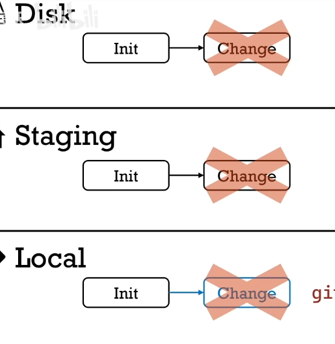
-   这里 1 代表回滚 1 个 commit 历史

## reset vs rever

和 git reset 不同，git revert 本质上是**增加**一个 反相的 commit

-   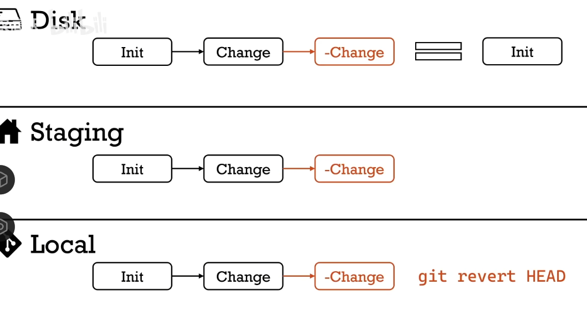
-   好处 1：可以指定 hash 只撤销其中一个 commit
-   好处 2：revert 只能前进不许后退，同理在公有分支上 只能前进 不许后退
    -   main，master。因为你一旦改了共有分支，别人 pull main 时就 conflict 了

私有分支上可以使用 reset

-   不过同步时要使用 git push -f。因为此时远端比本地少了 commit，会 rejected

## 评论对 Stage 的理解

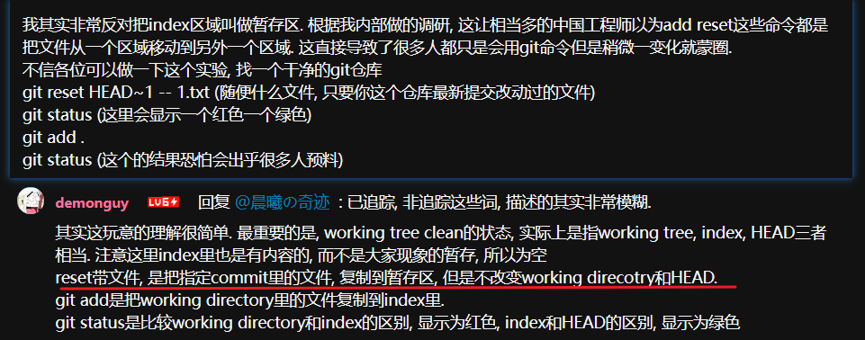

-   stage 不是一直空的，这里 `git reset HEAD~1 -- 1.txt` 用于将指定文件（在这种情况下为 1.txt）在暂存区中的状态重置为 HEAD~1 （HEAD 前一个结点） 提交中的状态。 所以 head stage workdirectory 三个里只有 stage 变了
    -   HEAD~1 提交中的状态是什么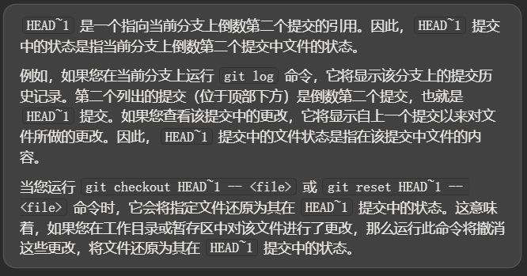

# 学习方法总结

## 先 fork 尝试解决方案

在尝试网上和别人给出的方案时，不要立刻对自己的原文件做处理。而是像 GitHub flow 一样，先 fork 一个出来尝试一下方法，这样及时方法错了，也不会对原 repo 造成损害。

fork 的不行就制作一个更简单的 demo

# 知识总结

## Git 的好处

引子：

> 1.  Do you use source control? - joel Spolsky
>     I’ve used commercial source control packages, and I’ve used CVS, which is free, and let me tell you, CVS is fine.
>
> But if you don’t have source control, you’re going to stress out trying to get programmers to work together. Programmers have no way to know what other people did. Mistakes can’t be rolled back easily.
>
> The other neat thing about source control systems is that the source code itself is checked out on every programmer’s hard drive — I’ve never heard of a project using source control that lost a lot of code.

## Git 和 CVS 的区别

### CVS

CVS 是 Concurrent Versions System 的缩写，它是一种版本控制系统，用于在开发过程中跟踪和管理源代码的更改。它允许多个开发人员同时在同一项目上工作，同时确保每个人的更改不会与其他人的更改冲突。CVS 通过在服务器上维护一个中央存储库来实现这一点，开发人员可以从中检出代码，进行更改并将更改提交回存储库。

CVS 是一个非常古老的版本控制系统，最初发布于 1986 年。尽管它曾经非常流行，但现在已经被更新的版本控制系统（如 Git 和 Subversion）所取代。

#### CVS 缺点

CVS 作为一种版本控制系统，也有一些缺点。其中一个缺点是 CVS 的更改可能会很耗时。

此外，如果提交中存在错误，CVS 不会进行提交[<sup>[1]</sup>](https://www.geeksforgeeks.org/difference-between-concurrent-versions-system-cvs-and-subversion-svn/)。

CVS 还有一些其他的缺点。例如，它不支持原子提交，这意味着如果一个提交包含多个文件的更改，那么这些更改可能会被部分提交。

此外，CVS 不支持对目录的版本控制，也不支持对文件名和目录名的重命名。

总之，尽管 CVS 曾经非常流行，但现在已经被更新的版本控制系统（如 Git 和 Subversion）所取代。

#### git 有什么优点

Git 是一种分布式版本控制系统，与 CVS 这种集中式版本控制系统相比，它具有许多优点。例如，Git 允许开发人员在本地进行操作，这意味着他们可以在离线状态下工作，并且只有在更改准备好时才需要连接到主存储库。这也有助于减少对主存储库的网络流量[<sup>[1]</sup>](https://stackoverflow.com/questions/802573/difference-between-git-and-cvs)。

此外，Git 避免了单点故障的问题。由于存储库是分布在本地副本中的，因此如果主存储库发生故障，也不必担心。主存储库可以从其中一个本地副本中恢复[<sup>[1]</sup>](https://stackoverflow.com/questions/802573/difference-between-git-and-cvs)。

Git 还在合并和冲突解决方面优于 CVS。Git 被设计用于开源协作，因此它能够有效地处理来自多个贡献者的合并和冲突解决[<sup>[2]</sup> SVN 和 Git 的介绍](https://www.linode.com/docs/guides/svn-vs-git/)。

总之，Git 相比 CVS 具有许多优点，这也是为什么它现在已经成为最流行的版本控制系统之一。

## Git 和 SVN 的区别

各自的优缺点
[ SVN 和 Git 的介绍](https://www.linode.com/docs/guides/svn-vs-git/)。
